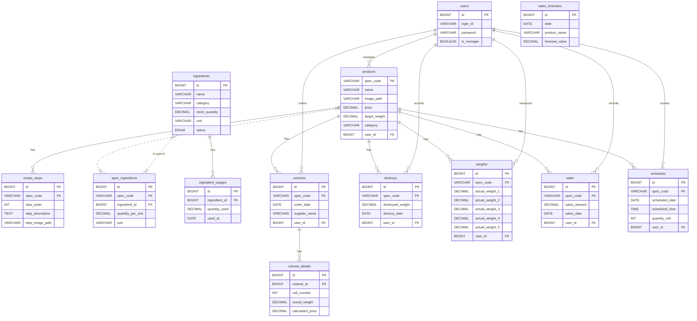

# COSTCO 業務効率化システム

## 概要

本システムは、COSTCO のデリ部門における業務効率化と最適化を目的とした Web アプリケーションです。売上予測機能を核とし、データに基づいた客観的な意思決定を支援することで、食品ロスや残業代の削減、利益向上を目指します。

## 主な機能

- **売上予測機能**:
  - 日別/週別/年別での売上データをグラフで可視化
  - 曜日別目標金額の設定・表示
  - OpenAI API を活用した売上傾向の予測コメント生成
- **商品（SPEC）管理**:
  - 商品の新規登録・編集・削除・一覧表示
  - `spec_code`（製造番号）による管理
- **売上管理**:
  - 売上データの登録・蓄積
- **食材管理**:
  - 食材発注、使用食材登録、在庫確認
- **VOLUME 管理（外部発注管理）**:
  - 外部発注の登録・編集・閲覧
- **DESTROY 管理（廃棄管理）**:
  - 廃棄量の登録・閲覧
- **WEIGHT 管理（品質管理）**:
  - 商品重量の実測値登録と目標値との乖離チェック
- **製造予定管理**:
  - 製造予定（時間・工程）の登録・閲覧

## 技術スタック

- **バックエンド**: PHP 8.x, Laravel 8.x
- **フロントエンド**: JavaScript, Chart.js, Laravel Blade
- **データベース**: MySQL 8.x
- **インフラ**: Docker, Docker Compose, Nginx
- **外部 API**: OpenAI API
- **認証**: Laravel Fortify

## インストール・セットアップ手順

### 1. リポジトリのクローン

```bash
git clone git@github.com:Estra-Coachtech/laravel-docker-template.git
mv laravel-docker-template costco-app
cd costco-app
```

### 2. 環境ファイルの準備

`.env.example` ファイルをコピーして `.env` ファイルを作成します。

```bash
cp src/.env.example src/.env
```

作成した `src/.env` ファイルを環境に合わせて編集してください。特にデータベース接続情報や OpenAI の API キーが必要です。

```env
DB_CONNECTION=mysql
DB_HOST=mysql
DB_PORT=3306
DB_DATABASE=laravel_db
DB_USERNAME=user
DB_PASSWORD=password

OPENAI_API_KEY=your_openai_api_key
```

### 2. Docker コンテナのビルドと起動

Docker Desktop アプリケーションを立ち上げてから、以下のコマンドを実行します。

```bash
docker-compose up -d --build
```

### 3. Laravel 環境構築

まず、PHP コンテナに入ります。

### 4. 依存パッケージのインストール

```bash
docker-compose exec app composer install
```

### 5. アプリケーションキーの生成

```bash
docker-compose exec app php artisan key:generate
```

### 6. データベースのマイグレーションとシーディング

```bash
# テーブルを作成The provider refused to serve this request based on the content
(Request ID: dd6d12ab-9a35-4953-990c-d35c82b1eae7)
docker-compose exec app php artisan migrate

# 初期データ投入
docker-compose exec app php artisan db:seed
```

### 7. アプリケーションへのアクセス

ブラウザで `http://localhost:8080` にアクセスしてください。
（`docker-compose.yml`で設定されているポート番号に応じて変更してください）

## DB 設計 (ER 図)



## ディレクトリ構成（主要部分）

```
costco-app/
├── docker/              # Docker関連の設定ファイル
├── documents/           # 設計書などのドキュメント
├── src/                 # Laravelアプリケーションのソースコード
│   ├── app/             # Controller, Modelなど
│   ├── config/          # アプリケーションの設定ファイル
│   ├── database/        # マイグレーション、シーダー、ファクトリ
│   ├── public/          # 公開ディレクトリ (CSS, JS, 画像など)
│   ├── resources/       # Bladeテンプレート、言語ファイルなど
│   └── routes/          # ルーティング定義
└── docker-compose.yml   # Docker Compose設定ファイル
```
